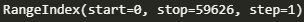
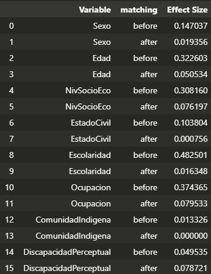
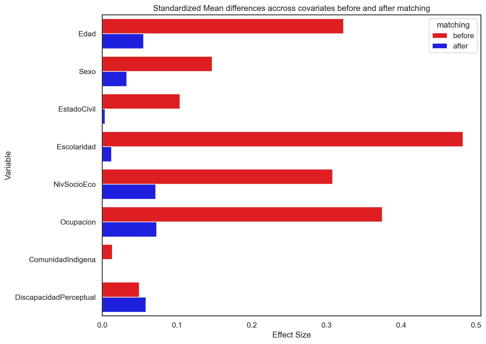

# propensity-score
#### *Participantes del estudio*
En el sistema de Centros de Integracion Juvenil CIJ3.0 se encuentran 93586 registros con Entrevista Inicial e Historia Clinica.
La muestra inicial para este proyecto 93586 que pertenecian a los registros en los años 2021-2023. Los sujetos que cumplian los siguientes criterios fueron excluidos del estudio al inicio del estudio:
1. Los sujetos que no sean primerizos
2. Los sujetos que fueran de algunos centros de costo en especifico 
3. Los sujetos que no hayan llegado a Historia Clinica
Tras excluir a 33960 la muestra resultante para realizar el proyecto es de 

### Herramientas usadas 
#### *python pandas*
@software{reback2020pandas,
    author       = {The pandas development team},
    title        = {pandas-dev/pandas: Pandas},
    month        = feb,
    year         = 2020,
    publisher    = {Zenodo},
    version      = {latest},
    doi          = {10.5281/zenodo.3509134},
    url          = {https://doi.org/10.5281/zenodo.3509134}
}

#### *python psm*
A. Kline and Y. Luo, PsmPy: A Package for Retrospective Cohort Matching in Python, 2022 44th Annual International Conference of the IEEE Engineering in Medicine & Biology Society (EMBC), 2022, pp. 1354-1357, doi: 10.1109/EMBC48229.2022.9871333.

### *Proceso de obtencion de datos*
El sistema de Centros de Integracion Juvenil CIJ3.0 contiene una base de datos que hace referencia a la entrevista inicial, en esta entrevista inicial el sujeto contesta una serie de preguntas que nos permite conocer sus datos sociodemograficos y el patron de consumo, posterior a este paso el sujeto es citado de vuelta para un cuestionario de historia clinica donde se le realizan preguntas mas especificas sobre datos medicos, es normal que debamos esperar que algunos pacientes no lleguen a este paso por lo que consideramos esta parte un filtro de exclusion en nuestro modelo.

### *Objetivos del proyecto*
1. *Propensity Score Matching (PSM):*
    - Obtener un grupo sintetico mediante propensity score matching(psm) designando como variable dependiente a la  migracion. 
    - Encontrar las covariables que tienen efecto sobre la migracion.
2. *Data Mining:*
    - Realizar analisis de texto para obtener informacion
    - Describir ambos grupos (Control y Sintetico) con la informacion obtenida

### *Covariables*
Las variables son las siguientes: sexo, edad, estado civil, escolaridad, ocupacion, comunidad indigena, discapacidad perceptual.

Las covariables muestran que el tamaño de efecto disminuye, lo cual nos indica que se trata de un buen emparejamiento

