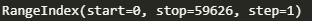
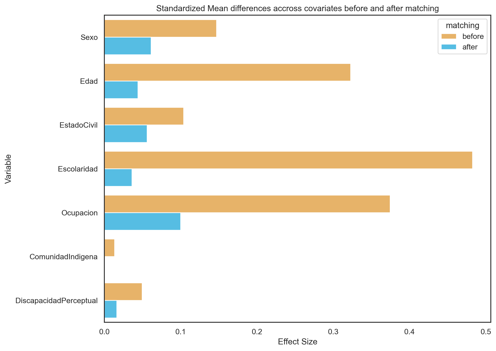

# propensity-score
### Welcome to the Propensity Score Matching and Data Mining Project

#### *Participantes del estudio*
En el sistema de Centros de Integracion Juvenil CIJ3.0 se encuentran 93586 registros con Entrevista Inicial e Historia Clinica.
La muestra inicial para este proyecto 93586 que pertenecian a los registros en los años 2021-2023. Los sujetos que cumplian los siguientes criterios fueron excluidos del estudio al inicio del estudio:
1. Los sujetos que no sean primerizos
2. Los sujetos que fueran de algunos centros de costo en especifico 
3. Los sujetos que no hayan llegado a Historia Clinica
Tras excluir a 33960 la muestra resultante para realizar el proyecto es de 

### Herramientas usadas 
#### *python pandas*
@software{reback2020pandas,
    author       = {The pandas development team},
    title        = {pandas-dev/pandas: Pandas},
    month        = feb,
    year         = 2020,
    publisher    = {Zenodo},
    version      = {latest},
    doi          = {10.5281/zenodo.3509134},
    url          = {https://doi.org/10.5281/zenodo.3509134}
}

#### *python psm*
A. Kline and Y. Luo, PsmPy: A Package for Retrospective Cohort Matching in Python, 2022 44th Annual International Conference of the IEEE Engineering in Medicine & Biology Society (EMBC), 2022, pp. 1354-1357, doi: 10.1109/EMBC48229.2022.9871333.

### *Proceso de obtencion de datos*
El sistema de Centros de Integracion Juvenil CIJ3.0 contiene una base de datos que hace referencia a la entrevista inicial, en esta entrevista inicial el sujeto contesta una serie de preguntas que nos permite conocer sus datos sociodemograficos y el patron de consumo, posterior a este paso el sujeto es citado de vuelta para un cuestionario de historia clinica donde se le realizan preguntas mas especificas sobre datos medicos, es normal que debamos esperar que algunos pacientes no lleguen a este paso por lo que consideramos esta parte un filtro de exclusion en nuestro modelo.


### *Objetivos del proyecto*
1. *Propensity Score Matching (PSM):*
    - Obtener un grupo sintetico mediante propensity score matching(psm) designando como variable dependiente a la  migracion. 
    - Encontrar las covariables que tienen efecto sobre la migracion.
2. *Data Mining:*
    - Realizar analisis de texto para obtener informacion
    - Describir ambos grupos (Control y Sintetico) con la informacion obtenida

### *Covariables*
Las variables son las siguientes: sexo, edad, estado civil, escolaridad, ocupacion, comunidad indigena, discapacidad perceptual.

Las covariables muestran que el tamaño de efecto disminuye, lo cual nos indica que se trata de un buen emparejamiento



```
# *Codigo*
### *Librerias*
import pandas as pd
import warnings
from psmpy import PsmPy
from psmpy.functions import cohenD
from psmpy.functions import *
sns.set(rc={'figure.figsize':(10,8), 'font.size': 1.3})
import re
```
### *Read data*
```
warnings.filterwarnings("ignore")
df_dataset = pd.read_csv('datasets/SetRegexFin.csv')
df_comorb = pd.read_csv('datasets/regex_comorb.csv')
df_antfam = pd.read_csv('datasets/regex_antfam.csv')
df_diag = pd.read_csv('datasets/regex_diag.csv')
df_catescolar = pd.read_csv('datasets/CatEscolaridad.csv')
df_catedociv = pd.read_csv('datasets/CatEstadoCivil.csv')
df_catlgbt = pd.read_csv('datasets/CatLgbt.csv')
df_catEstrato = pd.read_csv('datasets/CatEstratoSocial.csv')
df_catocup = pd.read_csv('datasets/CatOcupacion.csv')
df_pais = pd.read_csv('datasets/Pais.csv')
df_lugnac = pd.read_csv('datasets/LugNac.csv')
df_EUA = pd.read_csv('datasets/EstadosEUA.csv')
df_cat008 = pd.read_csv('datasets/CatComunMet008.csv')
df_nivsoc = pd.read_csv('datasets/CatEstratoSocial.csv')
```
### *def funtions*
```
def gen_list(df):
    """
    Generate a list of columns in a DataFrame
    param: df_DataFrame
    return: list of columns
    """
    listexc = []
    list = ['FolioId','Migracion', 'Edad', 'Sexo', 'EstadoCivil', 'Escolaridad' , 'Ocupacion', 'NivSocioEco', 'ComunidadIndigena', 'DiscapacidadPerceptual' ] # Columns to include
    for col in df.columns:
        if col not in list:
            listexc.append(col) # Columns to exclude
    return listexc

def get_psm(df_dataset, listinclude):
    """
    Initialize PsmPy Class
    param: df_DataFrame, list of columns to exclude
    return: psm object
    """
    psm = PsmPy(df_dataset, treatment= 'Migracion', indx= 'FolioId', exclude = listinclude)
    psm.logistic_ps()
    return psm

def moddatagen(df_dataset):
    """
    Modify the DataFrame to be used in the PSM
    param: df_DataFrame
    return: df_DataFrame modified
    """
    df_dataset['Migracion'] = df_dataset['Migracion'].fillna(0)
    df_dataset['Migracion'] = df_dataset['Migracion'].replace('Si', 1)
    df_dataset['ComunidadIndigena'] = df_dataset['ComunidadIndigena'].fillna(0)
    df_dataset['ComunidadIndigena'] = df_dataset['ComunidadIndigena'].replace('Si', 1)
    df_dataset['DiscapacidadPerceptual'] = df_dataset['DiscapacidadPerceptual'].fillna(0)
    df_dataset['DiscapacidadPerceptual'] = df_dataset['DiscapacidadPerceptual'].replace('Si', 1)
    df_dataset['Migracion']
    return df_dataset

def dict_data (df_catescolar, df_catedociv, df_catlgbt, df_catocup, df_pais, df_nivsoc):
    """
    Generate a dictionary of the categories in the DataFrames
    param: df_DataFrames
    return: dictionaries
    """
    dict_escolar = dict(zip(df_catescolar['Descripcion'], df_catescolar['ComunId']))
    dict_edociv = dict(zip(df_catedociv['Descripcion'], df_catedociv['ComunId']))
    dict_lgbt = dict(zip(df_catlgbt['Descripcion'], df_catlgbt['ComunId']))
    dict_ocup = dict(zip(df_catocup['Descripcion'], df_catocup['ComunId']))
    dict_pais = dict(zip(df_pais['PaisId'], df_pais['Descripcion']))
    dict_nivsoc = dict(zip(df_nivsoc['ComunId'], df_nivsoc['Descripcion']))
    return dict_escolar, dict_edociv, dict_lgbt, dict_ocup, dict_pais, dict_nivsoc

def mod_data (df ,dict_escolar, dict_edociv, dict_lgbt, dict_ocup, dict_pais, dict_nivsoc):
    """
    Modify the DataFrame to be used in the PSM
    param: df_DataFrame, dictionaries
    return: df_DataFrame modified
    """
    df['Escolaridad'] = df['Escolaridad'].map(dict_escolar)
    df['EstadoCivil'] = df['EstadoCivil'].map(dict_edociv)
    df['LGBTTTI'] = df['LGBTTTI'].map(dict_lgbt)
    df['Ocupacion'] = df['Ocupacion'].map(dict_ocup)
    df['PaisNac'] = df['LugarNacimiento'].map(dict_pais)
    df['NivSocioEco'] = df['NivSocioEco'].map(dict_nivsoc)
    return df

def mod_df (df):
    """
    Modify the DataFrame to be used in the PSM
    param: df_DataFrame
    return: df_DataFrame modified
    """
    df.drop(columns=['Motivo10', 'Diag_TRS_Eje1ComunNomenclatura_9', 'Diag_TRS_Eje1Previo-Subsecuente_9', 'Diag_TRS_Eje1CodigoCompuesto_9', 'Diag_TRS_Eje1Codigo_9', 'Diag_TRS_Eje1Descripcion_9', 'Diag_TRS_Eje1ComunNomenclatura_10', 'Diag_TRS_Eje1Previo-Subsecuente_10', 'Diag_TRS_Eje1CodigoCompuesto_10', 'Diag_TRS_Eje1Codigo_10', 'Diag_TRS_Eje1Descripcion_10'] , axis=1, inplace=True) # Drop columns
    df.drop(columns=['AntecedentesPNPGrupoSanguineo', 'AntecedentesPNPFactorRH', 'TipoAlimentacionSuficienteCantidad', 'TipoAlimentacionSuficienteCalidad', 'TipoAlimentacionAdecuadaCantidad', 'TipoAlimentacionAdecuadaCalidad', 'TipoAlimentacionBalanceadaCantidad', 'TipoAlimentacionBalanceadaCalidad', 'AntecedentesPNPReligion', 'AntecedentesPNPCuales'], axis=1, inplace=True) # Drop columns
    df.drop(columns=['PadecimientoActual', 'AntecedentesPadecimiento', 'AntecedentesHFTrastornosSustanciasComunId', 'AntecedentesHFTrastornosSustanciasCuales', 'AnecedentesHFTrastornosMentalesComunId', 'AnecedentesHFTrastornosMentalesCuales', 'AntecedentesHFOtrosComunId', 'AntecedentesHFOtrosCuales', 'VidaFamiliarEscolarLaboralEconomica' , 'AntecedentesSSEdadIVSA','AntecedentesSSNoParejasSexuales', 'AntecedentesSSPracticasSexualesRiesgoCuales', 'AntecedentesSSMetodosAnticonceptivosOtros', 'AntecedentesSSPruebaVIH' ], axis=1, inplace=True) # Drop columns
    df.drop(columns=['AntecedentesSSPruebaVIHFecha', 'AntecedentesSSPruebaVIHResultadoComun', 'AntecedentesSSPruebaVHC', 'AntecedentesSSPruebaVHCFecha', 'AntecedentesSSPruebaVHCResultadoComun', 'InterrogatorioASCardiovascularCuales', 'InterrogatorioASDigestivoCuales', 'InterrogatorioASEndocrinoCuales', 'InterrogatorioASHematologicoCuales', 'InterrogatorioASMusculoEsqueleticoCuales', 'InterrogatorioASNerviosoCuales'], axis=1, inplace=True) # Drop columns
    df.drop(columns=['InterrogatorioASReproductivoCuales', 'InterrogatorioASRespiratorioCuales', 'InterrogatorioASTegumentarioCuales', 'InterrogatorioASUrinarioCuales', 'InterrogatorioASEspecializadoCuales', 'SignosVitalesPeso', 'SignosVitalesTalla', 'SignosVitalesIMCComunId', 'SignosVitalesFC', 'SignosVitalesFR', 'SignosVitalesPulso', 'SignosVitalesTA', 'SignosVitalesTAhg', 'SignosVitalesTemperatura', 'HCEF_HabitusExterior', 'ExploracionEspecializadaCuales'], axis=1, inplace=True) # Drop columns
    for col in df.columns:
        reg = re.search(r'Compuesto_\d', col) 
        if reg:
            df.drop(columns=[col], axis=1, inplace=True) # Drop columns
            
    for col in df.columns:
        if col.startswith('Sust') or col.startswith('EdadI') or col.startswith('Orden') or col.startswith('UsoUlt') or col.startswith('Prime') or col.startswith('Segun') or col.startswith('Tercer') or col.startswith('Abst') or col.startswith('Ulti') or col.startswith('Dosis'):
            df.drop(columns=[col], axis=1, inplace=True)# Drop columns

    return df

def graf_psm(psm):
    """
    Generate a Propensity Score Matching 
    param: psm object
    return: plots
    """
    #psmdata = psm.knn_matched(matcher='propensity_logit', replacement=False, caliper=None, drop_unmatched=True) match 1:1
    psmdata = psm.knn_matched_12n(matcher='propensity_logit', how_many= 2) # match 1:N
    psm.plot_match(Title='Side by side matched controls', Ylabel='Number of patients', Xlabel='Propensity logit', names = ['Migracion', 'No Migracion'], colors = ['blue', 'red'], save=True)

dict_escolar, dict_edociv, dict_lgbt, dict_ocup, dict_pais, dict_nivsoc  = dict_data(df_catescolar, df_catedociv, df_catlgbt, df_catocup, df_pais, df_nivsoc)
df = mod_df(df_dataset)
listexclude = gen_list(df_dataset)
df_dataset = moddatagen(df_dataset)
df = mod_data(df_dataset, dict_escolar, dict_edociv, dict_lgbt, dict_ocup, dict_pais, dict_nivsoc)
psm = get_psm(df, listexclude)
psm.matched_ids
graf_psm(psm)

<Aqui Se ejecutan y se muestran los resultados con las graficas>
```
<Se crea un nuevo df con los folios pareados>
```
def gen_newdf (df_matched_ids, df_dataset):
    """
    Generate a new DataFrame with the matched ids
    param: df_matched_ids, df_DataFrame
    return: df_DataFrame
    """
    df_matched = df_dataset[df_dataset['FolioId'].isin(df_matched_ids['FolioId'])]
    df_matched = pd.concat([df_matched, df_dataset[df_dataset['FolioId'].isin(df_matched_ids['largerclass_0group'])]], axis= False)
    df_matched = pd.concat([df_matched, df_dataset[df_dataset['FolioId'].isin(df_matched_ids['largerclass_1group'])]], axis= False)
    return df_matched

def applyregex(row, regex):
    """
    Apply a regex to a row
    param: row, regex
    return: boolean
    """
    return any(re.search(regex,str(value))for value in row if value is not None)

def drop_col (df):
    """
    Drop columns in a DataFrame
    param: df_DataFrame
    return: df_DataFrame
    """
    for col in df.columns:
        if col.startswith('Diag') or col.startswith('Trast'):
            df.drop(columns=[col], axis=1, inplace=True) # Drop columns
    return df

def minertext (df, df_antfam, df_comorb, df_diag):
    """
    Apply regex to a DataFrame
    param: df_DataFrame, df_DataFrames
    return: df_DataFrame
    """
    
    #for idx, row in df_antfam.iterrows():
    #    regex = row['regex']
    #    new_colum = row['varname']
    #    df[new_colum] = df.apply(lambda row: applyregex(row,regex), axis=1).astype(int)

    #for idx, row in df_comorb.iterrows():
    #    regex = row['regex']
    #    new_colum = row['varname']
    #    df[new_colum] = df.apply(lambda row: applyregex(row,regex), axis=1).astype(int)

    #for idx, row in df_diag.iterrows():
    #   regex = row['regex']
    #    new_colum = row['varname']
    #    df[new_colum] = df.apply(lambda row: applyregex(row,regex), axis=1).astype(int)    
        
    df = drop_col (df)
    return df

new_df = gen_newdf(psm.matched_ids, df_dataset)
new_df.to_csv('results/MatchedData.csv', index=False)
intent = minertext(new_df, df_antfam, df_comorb, df_diag)
intent.to_csv('results/PsmRegex.csv')
df_score = psm.df_matched
df_score.to_csv('results/score-logit.csv')

```
